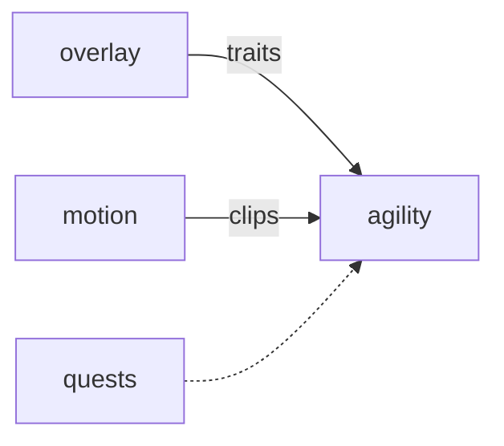

# Agility

**A timed obstacle course for the pet you already care for.**

A planned physics runner that uses each species' speed, jump, and stamina traits to shape its course.

**Stage: design scaffold.** This checkout contains a design document and a source placeholder. The experience below is planned; there is no runnable app or integrated service yet.

[Status](#status) · [Planned experience](#planned-experience) · [Contributor quickstart](#contributor-quickstart) · [Game design](docs/DESIGN.md) · [Ecosystem map](https://github.com/RicheyWorks/computerpets-ecosystem)

## Status

| Available today | What you can inspect |
| --- | --- |
| [Game design](docs/DESIGN.md) | Intended behavior, boundaries, and planned dependencies. |
| [Source placeholder](src/game.gd) | Godot Node stub; no project.godot or playable scene is checked in. |
| [MIT license](LICENSE) | Licensing terms for the repository. |

Gameplay, endpoints, integration arrows, and failure handling on this page describe implementation targets. No build/test harness, CI workflow, or product screenshots are included in this scaffold.

## Planned experience

- Pick one owned pet.
- Run a seeded daily course (same seed worldwide).
- Missed gate = time penalty, not death.
- Ghost of your best run + friends via Visitation ids.

### Planned technology

- Genre: **Physics runner**
- Engine: **Godot 4**
- Stack: Godot 4.3 · GDScript · rigid-body course · speed/jump traits from overlay
- Default surface: `Godot editor`

### Planned connections

These arrows show intended dependencies, rather than working integrations.



## Contributor quickstart

With access to this private repository, Git and PowerShell are enough to review the scaffold:

```powershell
git clone https://github.com/RicheyWorks/computerpets-agility.git
Set-Location computerpets-agility
Get-Content docs/DESIGN.md
Get-Content src/game.gd
```

Read [Game design](docs/DESIGN.md) before choosing implementation details. The commands above inspect the checked-in files; app installation, editor launch, and server startup become possible after a buildable project and entry point are added.

### First implementation target

**Daily seeded course, Rui only, ghost of your best time.**

You know it works when: Physics explode: last gate. Missing trait: species default, never another animal's numbers.

Treat this as an acceptance target for a future implementation. Start with the documented slice, add the required project setup and focused tests, and update these instructions with commands that work from a fresh clone.

## Design boundaries

1. Minigames cannot mint or burn NFTs by themselves (Minter is the write path).
2. Stats come from lived overlay care + Dojo caps, not cash shop.
3. Species kits stay inside Lore. Illegal hybrids never spawn.
4. Fail soft: the desktop overlay process is not this process.

**Required failure behavior:**

Physics explode → reset to last gate, never T-pose. Trait missing → species default, never another animal's numbers.

## Ecosystem

- [computerpets](https://github.com/RicheyWorks/computerpets) (traits)
- [computerpets-motion](https://github.com/RicheyWorks/computerpets-motion) (clips)
- [computerpets-quests](https://github.com/RicheyWorks/computerpets-quests) (daily course)
- [computerpets-telemetry](https://github.com/RicheyWorks/computerpets-telemetry)

Start with the [ComputerPets flagship](https://github.com/RicheyWorks/computerpets) for the desktop pet. This repository describes an optional extension; the [ecosystem map](https://github.com/RicheyWorks/computerpets-ecosystem) explains the broader plan.

## License

MIT. See [LICENSE](LICENSE).
