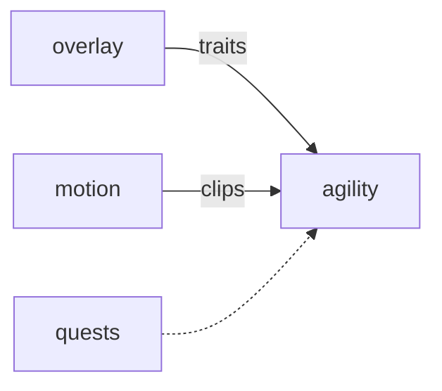

# Agility

**Pet Agility Course** — Physics obstacle course that scores a pet's speed, jump, and stamina traits.

Part of [ComputerPets](https://github.com/RicheyWorks/computerpets). Map: [computerpets-ecosystem](https://github.com/RicheyWorks/computerpets-ecosystem).

| | |
| --- | --- |
| Status | Design scaffold — loop and engine frozen |
| License | MIT |
| Tokens | Minigames never mint or burn. Tired overlay, not a dead lineage. |
| First pet | [Meet Rui first](https://github.com/RicheyWorks/computerpets/blob/main/docs/START-HERE.md). This game is optional. |

## The loop

The overlay already has walk and carry. Agility is the stopwatch: same body, timed gates, no combat. Reed the frog and Rui do not share a jump arc.

## Who plays

Players timing a body they already have.

## What it is not

Not combat. Reed and Rui do not share a jump arc.

## Genre and engine

- Genre: **Physics runner**
- Engine: **Godot 4**
- Stack: Godot 4.3 · GDScript · rigid-body course · speed/jump traits from overlay
- Default surface: `Godot editor`

## Architecture



## How you play

1. Pick one owned pet.
2. Run a seeded daily course (same seed worldwide).
3. Missed gate = time penalty, not death.
4. Ghost of your best run + friends via Visitation ids.

## First slice

Build this and stop.

**Daily seeded course, Rui only, ghost of your best time.**

You know it works when: Physics explode: last gate. Missing trait: species default, never another animal's numbers.

## Environment

Godot 4.3

## Failure doctrine

Physics explode → reset to last gate, never T-pose. Trait missing → species default, never another animal's numbers.

Canon rules that never yield:

- 210 living kinds. No illegal hybrids.
- Overlay pets can get tired, sick, or hide. Tokens are not burned by a minigame.
- Desktop walk stays the main quest. Closing Agility must leave Rui walking.

## Neighbors

- computerpets (traits)
- computerpets-motion (clips)
- computerpets-quests (daily course)
- computerpets-telemetry

## Layout

```
computerpets-agility/
  README.md
  LICENSE
  docs/DESIGN.md
  src/                implementation lands here
```

## Run (Windows)

```powershell
godot --path . --import; F5 in editor. Export Windows exe for overlay-adjacent play.
```

Meet Rui first via the [flagship start-here](https://github.com/RicheyWorks/computerpets/blob/main/docs/START-HERE.md). This game is optional.

## Links

- Flagship: [RicheyWorks/computerpets](https://github.com/RicheyWorks/computerpets)
- This repo: [RicheyWorks/computerpets-agility](https://github.com/RicheyWorks/computerpets-agility)
- Map: [RicheyWorks/computerpets-ecosystem](https://github.com/RicheyWorks/computerpets-ecosystem)
- Design file: [docs/DESIGN.md](docs/DESIGN.md)

## License

MIT. See [LICENSE](LICENSE).

---

*Two hundred ten living kinds. Keep them so a line does not go quiet.*
